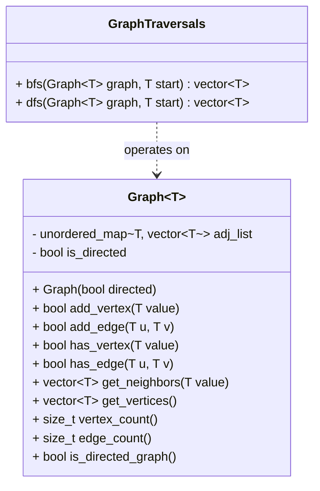

# Implementation Plan - C++ Generic Graph Library

Design and implement a modern, generic header-only C++ Graph Library that supports directed and undirected graphs, vertex uniqueness, dynamic graph expansion, and search traversals (BFS/DFS).

## User Review Required

> [!IMPORTANT]
> **Design Choice: Directed vs. Undirected Graph Representation**
> We recommend a unified `Graph<T>` template class that takes a boolean flag `is_directed` in its constructor (defaulting to `false` for undirected). This avoids code duplication while giving full flexibility. Alternatively, we could create separate `DirectedGraph<T>` and `UndirectedGraph<T>` subclasses inheriting from a base `Graph<T>`.

> [!NOTE]
> **Header-Only Implementation**
> Since `Graph<T>` is a C++ template class, its implementation must reside in header files (`.hpp`) so that it can be instantiated with arbitrary types (`std::string`, `int`, custom structs) without linker errors.

## Open Questions

> [!QUESTION]
> 1. Should `add_edge(u, v)` automatically insert vertices `u` and `v` if they don't already exist in the graph, or should missing vertices cause `add_edge` to fail/throw? *(Recommended: Auto-insert missing vertices for a smoother developer experience).*
> 2. Should we support weighted edges in this initial version, or stick strictly to unweighted graphs for now? *(Recommended: Start with unweighted graphs as described in `Overview.md`, but structure the adjacency representation so edge weights can be added easily in a future update).*

## Architecture & Data Structures



### Optimal Storage Choice: Map of Vectors (`unordered_map<T, vector<T>>`)
* **Unique vertices**: `unordered_map` keys guarantee unique vertex identifiers with average $O(1)$ lookup time.
* **Neighborhood queries**: `get_neighbors(v)` returns the neighbor list in $O(1)$ hash lookup + vector copy (or `const` reference access).
* **Deterministic Traversal**: Using `std::vector<T>` for neighbor lists preserves edge insertion order, leading to predictable BFS and DFS results. Duplicate edges are prevented during `add_edge`.

---

## Proposed Changes

### Core Library Implementation

#### [NEW] [graph.hpp](file:///c:/Users/shams/IdeaProjects/cppSandbox/Scratch/GraphLibrary/src/graph.hpp)
- Implement `Graph<T>` template class.
- Provide methods:
  - `add_vertex(const T& val)`: Inserts vertex if not present.
  - `add_edge(const T& u, const T& v)`: Adds edge (and reverse edge if undirected).
  - `has_vertex(const T& val)`: Checks vertex existence.
  - `has_edge(const T& u, const T& v)`: Checks edge existence.
  - `get_neighbors(const T& val)`: Returns `const std::vector<T>&` or vector of neighbors.
  - `get_vertices()`: Returns all vertices in graph.
  - Utility methods (`vertex_count()`, `edge_count()`, `is_directed()`).

#### [NEW] [graph_traversals.hpp](file:///c:/Users/shams/IdeaProjects/cppSandbox/Scratch/GraphLibrary/src/graph_traversals.hpp)
- Implement `GraphTraversals` class/namespace containing template static functions:
  - `bfs(const Graph<T>& graph, const T& start)`: Queue-based Breadth-First Search. Returns `std::vector<T>` of visited nodes.
  - `dfs(const Graph<T>& graph, const T& start)`: Stack/Recursive-based Depth-First Search. Returns `std::vector<T>` of visited nodes.

### Application & Verification

#### [MODIFY] [main.cpp](file:///c:/Users/shams/IdeaProjects/cppSandbox/Scratch/GraphLibrary/src/main.cpp)
- Add comprehensive test suites and demonstrative examples matching the user's example in `Overview.md`.
- Test directed and undirected graphs.
- Test disconnected components, single vertex, cycle detection / visited tracking in traversals.
- Test template instantiations with `std::string` and `int`.

---

## Verification Plan

### Automated Tests & Execution
Compile and run the program using `g++` (C++17 standard):
```powershell
g++ -std=c++17 -Wall -Wextra -I Scratch/GraphLibrary/src Scratch/GraphLibrary/src/main.cpp -o Scratch/GraphLibrary/main.exe
./Scratch/GraphLibrary/main.exe
```

### Manual Verification Scenarios
1. **Basic Operations**: Verify vertex addition, edge addition, neighbor retrieval, and unique vertex guarantees.
2. **Directed vs Undirected Behavior**: Confirm `add_edge("A", "B")` in directed graph only adds `A -> B`, whereas undirected adds `A -> B` and `B -> A`.
3. **BFS Traversal**: Confirm level-by-level traversal order.
4. **DFS Traversal**: Confirm depth-first traversal order and ensure loops/cycles do not cause infinite recursion/stack overflow.
5. **Non-existent Start Vertex**: Confirm traversal functions handle non-existent start nodes gracefully.
